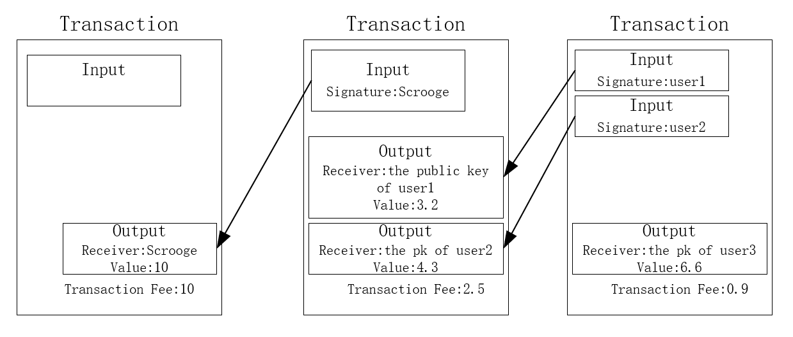

# Bitcoin and Cryptocurrency Technologies

### Assignment 1: ScroogeCoin

根据作业描述，ScroogeCoin的数据结构如下图所示

- 每一个Transaction包含该transaction的hash值，所有输入的链表和所有输出的链表。
- 每一个Transaction的输入包含指向该输入的前一个Output的hash值，该输入的前一个Output的索引和该输入的签名。
- 每一个Transaction的输出包含输出接收者的Public Key和输出值。

同时，Scrooge中引入了UTXO（Unspending transaction output），表示没有消费的余额数值。这样能够判断当前输入所对应的输出是否有效。

